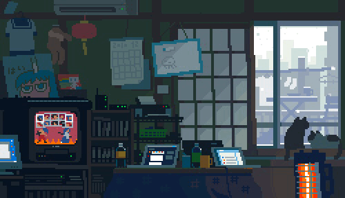

<!-- ─────────────────────────────────────────────────────────── -->
<!--  Krishna Vinod · GitHub Profile README                     -->
<!-- ─────────────────────────────────────────────────────────── -->

  

## Hi, I'm Krishna Vinod

&nbsp;&nbsp;
&nbsp;&nbsp;

**Robotics · Event-based Vision · Machine Learning**

I build research software at the intersection of robot perception and learning,
with a focus on event cameras and visual servoing.
I care about reproducible pipelines, clean code, and systems that work on real hardware.

 

### About Me

- Working on **event-based visual servoing** and robot manipulation with event cameras
- Interested in representation learning, synthetic event generation, and vision-language-action models
- Building reproducible research pipelines with clean configs, scripts, and documentation
- Contributing to open-source benchmarks and datasets for event-based vision
- Open to research collaborations, internships, and full-time roles in robotics & ML

 

### Featured Projects

<table>
  <tr>
    <td width="50%" valign="top">
      <b><a href="https://github.com/Krishnaa-Vinod/SEBVS">SEBVS</a></b> 
      Synthetic event-based visual servoing for robot navigation and manipulation
    </td>
    <td width="50%" valign="top">
      <b><a href="https://github.com/Krishnaa-Vinod/enavipp-data-pipeline">ENavi++ Data Pipeline</a></b> 
      Event-camera navigation dataset pipeline: download, preprocess, visualize, PyTorch dataloader
    </td>
  </tr>
  <tr>
    <td valign="top">
      <b><a href="https://github.com/Krishnaa-Vinod/eventgen-unet">eventgen-unet</a></b> 
      Synthetic event voxel generation from RGB using a lightweight U-Net
    </td>
    <td valign="top">
      <b><a href="https://github.com/Krishnaa-Vinod/ur5_manipulation_event_camera">UR5 + Event Camera</a></b> 
      UR5 robot manipulation experiments with event camera perception
    </td>
  </tr>
  <tr>
    <td valign="top">
      <b><a href="https://github.com/Krishnaa-Vinod/openVLA_server">OpenVLA Server</a></b> 
      Server wrapper for OpenVLA inference on GPU clusters
    </td>
    <td valign="top">
      <b><a href="https://github.com/Krishnaa-Vinod/panda_robot_learning">Panda Robot Learning</a></b> 
      OpenVLA with Franka Panda in MuJoCo — imitation and reinforcement learning
    </td>
  </tr>
</table>

 

### Tech Stack

  &nbsp;
  &nbsp;
  &nbsp;
  &nbsp;
  &nbsp;
  &nbsp;
  &nbsp;
  &nbsp;
  

 

---

### GitHub Stats

  

  

